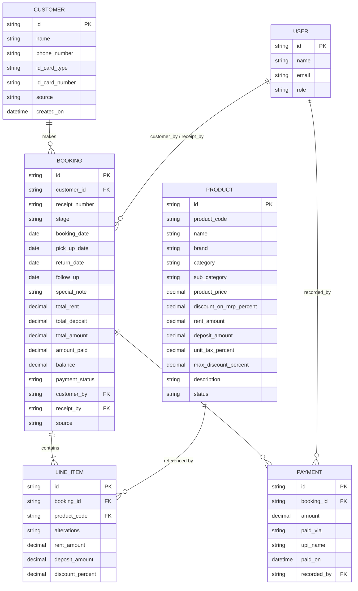
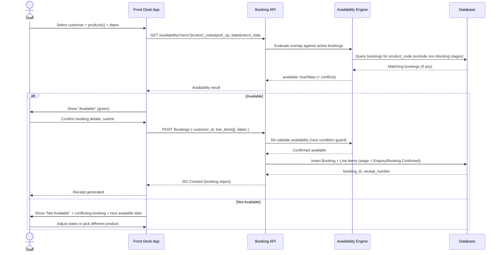
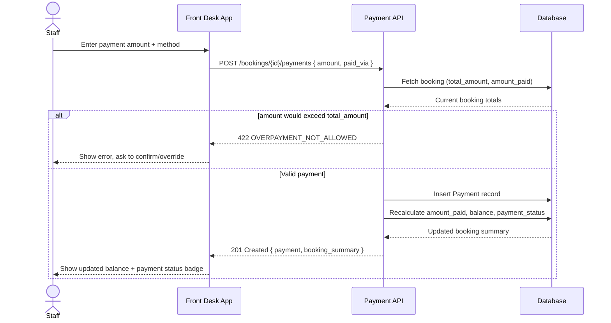
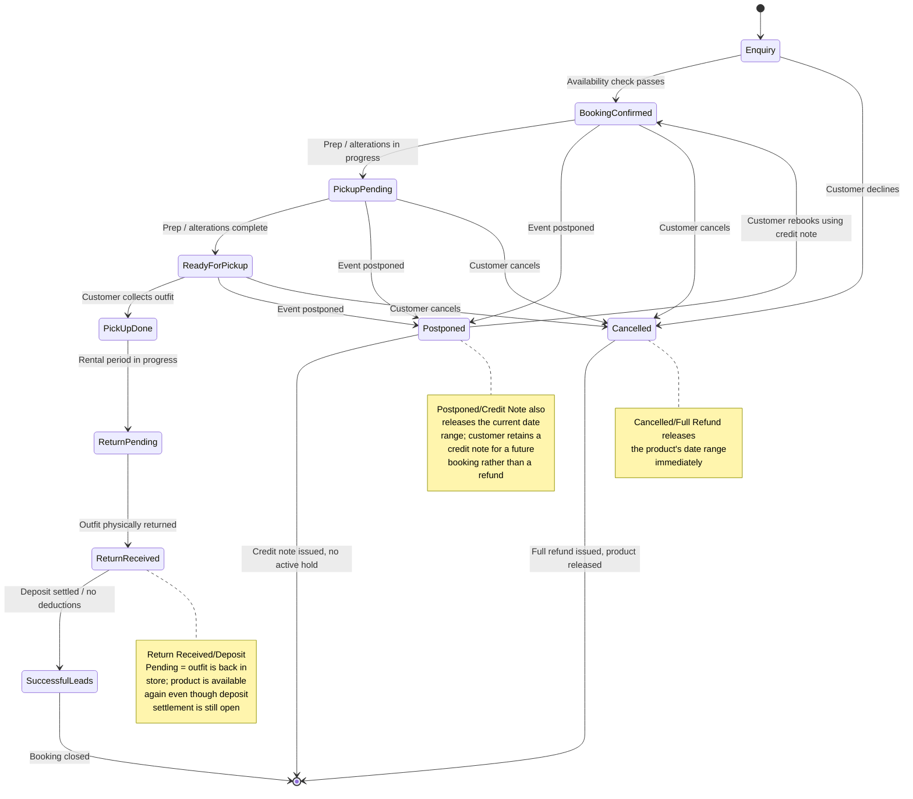
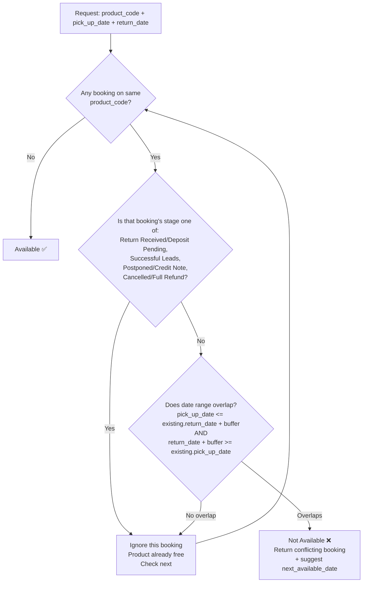
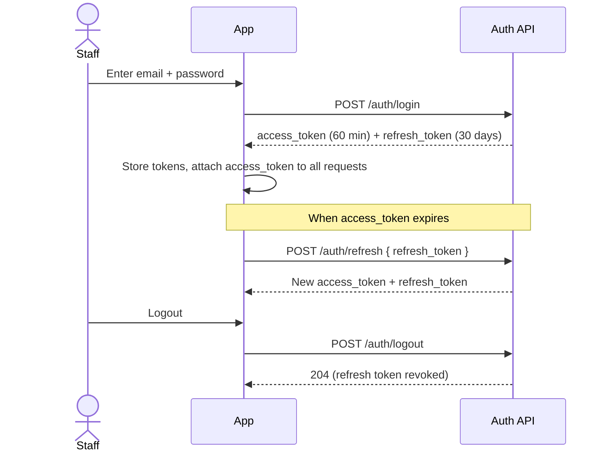
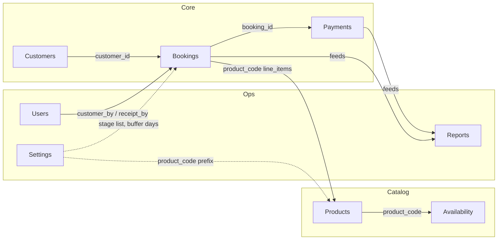

# Rental Outfit CRM — API Diagrams

Visual companion to `Rental-Outfit-CRM-API-Documentation.md`. All diagrams are Mermaid — render natively on GitHub/GitLab or any Mermaid-compatible viewer.

---

## 1. Entity Relationship Diagram

Shows how `Customer`, `Booking`, `Line Item`, `Payment`, `Product`, and `User` relate — including the fact that one customer can have many bookings (on different days or the same day), and one booking can have many line items and many payments.

**Key takeaway:** `Booking` is transactional and independent — a `Customer` has zero constraint on how many `Booking` rows they can have, including several on the same `booking_date`. Availability conflicts are checked at the `PRODUCT` ↔ `LINE_ITEM` date-range level, never at the customer level.

---

## 2. Create Booking Flow (with Availability Check)

The critical path: staff create a booking, the server checks product availability before allowing `Confirmed`, and either succeeds or returns a conflict.

---

## 3. Record Payment Flow

Shows how a payment recalculates the booking's balance and payment status automatically.

---

## 4. Booking Stage Lifecycle

The `stage` field drives the Kanban board (PRD §7.1.2) and gates the availability check. This state diagram shows valid transitions across the updated pipeline.

**Stages:** `Enquiry` → `Booking Confirmed` → `Pickup Pending` → `Ready for Pickup` → `Pick Up Done` → `Return Pending` → `Return Received/Deposit Pending` → `Successful Leads`, with `Postponed/Credit Note` and `Cancelled/Full Refund` as exit branches available from any pre-pickup stage.

---

## 5. Product Availability Decision Logic

Visualizes the conflict rule from PRD §7.3.3 / API doc §7.1, updated for the new stage list.

**Non-blocking stages** (product is free, excluded from conflict check): `Return Received/Deposit Pending`, `Successful Leads`, `Postponed/Credit Note`, `Cancelled/Full Refund`.
**Blocking stages** (product is held/reserved, included in conflict check): `Enquiry`, `Booking Confirmed`, `Pickup Pending`, `Ready for Pickup`, `Pick Up Done`, `Return Pending`.

> Flag for the business: treating `Enquiry` as blocking is a conservative default (a tentative enquiry holds the date). If enquiries should be soft holds that don't block other customers, move `Enquiry` to the non-blocking list — confirm before build.

---

## 6. Auth Flow

---

## 7. High-Level API Resource Map

How the main resource groups relate to each other at a glance.

