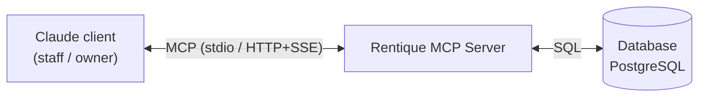
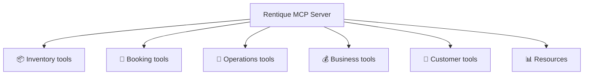
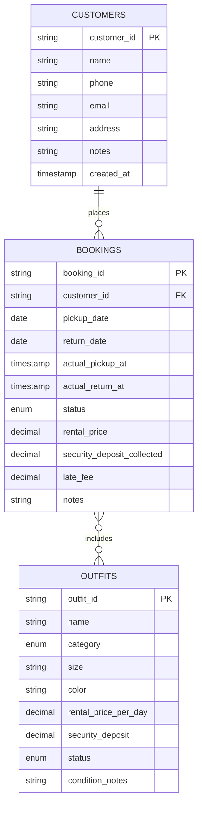
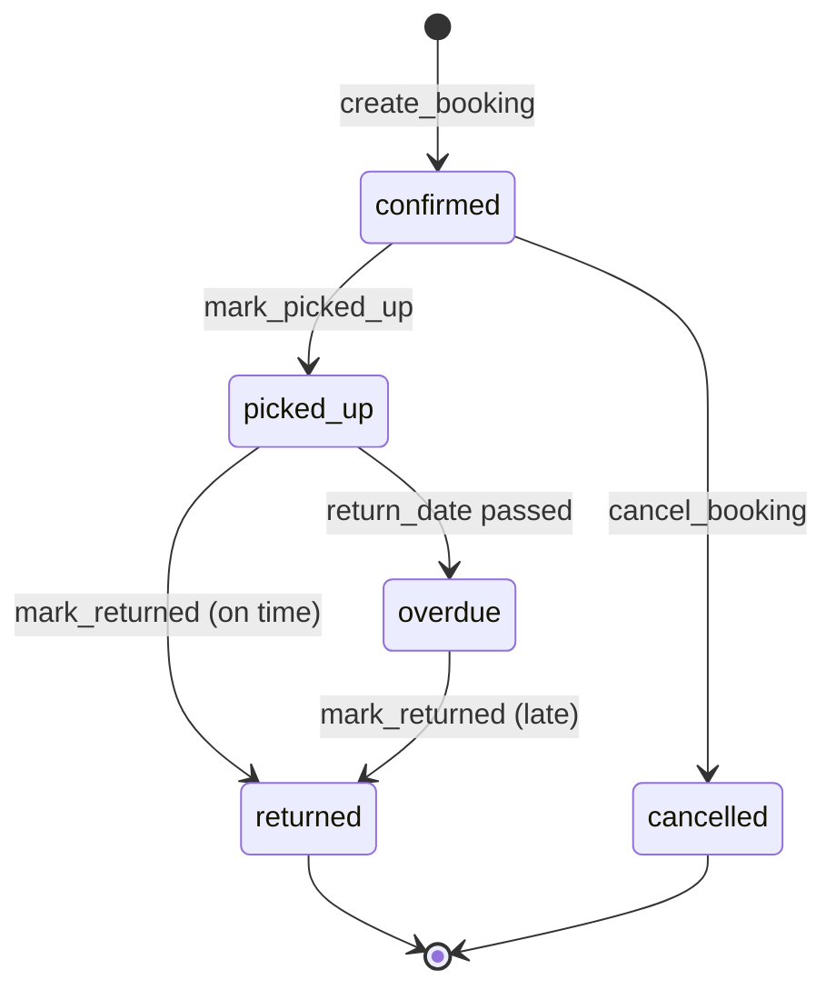
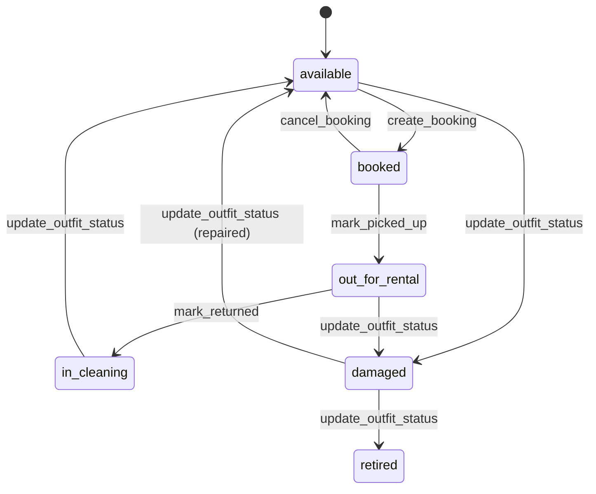
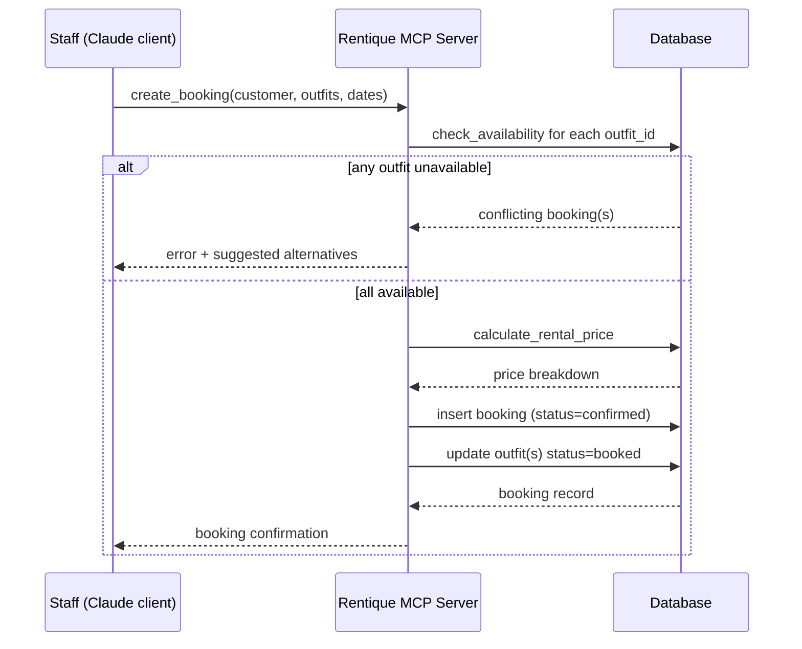

# Product Requirements Document: Rentique MCP Server

**Document owner:** [Your name]
**Status:** Draft v1.0
**Last updated:** September 1, 2026

---

## 1. Overview

### 1.1 Summary
Rentique MCP is a Model Context Protocol (MCP) server that exposes Rentique's outfit-rental business operations — inventory, bookings, logistics, customers, and business reporting — as structured tools and resources that any MCP-compatible AI client (Claude, Claude Code, Claude Desktop/Cowork, or an internal chat assistant) can call. It turns day-to-day store operations ("what's out for pickup today", "is the red lehenga free for the 14th", "book this outfit for a customer") into natural-language-driven actions, backed by a single source of truth.

### 1.2 Problem statement
Outfit rental businesses like Rentique currently manage inventory, bookings, and pickup/return logistics through a mix of spreadsheets, WhatsApp messages, and manual memory. This causes:
- Double-bookings of the same outfit on overlapping dates
- Missed pickups/returns and late-fee disputes
- No fast way to answer "what's available on date X" or "how did we do this month"
- Staff time lost to manual lookups instead of serving customers

### 1.3 Goal
Give staff (and eventually customers, via a front-of-house assistant) an AI-operable interface into Rentique's core systems, so common tasks — checking availability, creating a booking, tracking pickups/returns, and pulling business numbers — can be done conversationally, quickly, and without manual spreadsheet lookups, while keeping a single consistent record of truth.

### 1.4 Non-goals (v1)
- Payment processing / payment gateway integration
- Customer-facing self-serve booking (public web/chat widget) — future phase
- Multi-location / multi-warehouse inventory (assume single store to start)
- Automated marketing / notification campaigns (SMS/WhatsApp reminders can be a fast-follow)

---

## 2. Users & use cases

| Persona | Description | Example asks |
|---|---|---|
| **Store staff** | Front-desk staff handling walk-ins and phone bookings | "Is the navy blue sherwani, size 40, free for Oct 12–14?" / "Book it for Rahul Sharma, pickup Oct 12" |
| **Store owner/manager** | Owns Rentique, wants operational + financial visibility | "How did we do this month vs last?" / "What are our top 5 outfits this quarter?" |
| **Delivery/ops staff** | Handles physical pickup and return of outfits | "What's going out for pickup today?" / "Mark outfit #452 as returned" |
| **(Future) Customer** | End customer inquiring/booking outfits | "Do you have lehengas available for a wedding on Dec 3?" |

---

## 3. Architecture overview

- **MCP Server**: implements the tools/resources below over the MCP protocol (stdio or HTTP/SSE transport, per deployment target).
- **Backing store**: a relational database (recommended: PostgreSQL) holding `outfits`, `bookings`, `customers`, and derived views for reporting. SQLite acceptable for a single-location v1/prototype.
- **Clients**: Claude Desktop/Claude Code (staff-facing, internal use), Claude.ai via a custom connector (owner-facing reporting), and later a customer-facing chat surface.
- **Auth**: v1 assumes a trusted internal staff environment; add API-key or OAuth-based auth before any customer-facing exposure.

---

## 4. Data model (proposed)

### `outfits`
| Field | Type | Notes |
|---|---|---|
| outfit_id | string (PK) | e.g. `OUT-0452` |
| name | string | e.g. "Maroon Bridal Lehenga" |
| category | enum | lehenga, sherwani, saree, gown, suit, accessory, other |
| size | string | e.g. "M", "40", custom |
| color | string | |
| rental_price_per_day | decimal | base daily rate |
| security_deposit | decimal | |
| status | enum | available, booked, out_for_rental, in_cleaning, damaged, retired |
| condition_notes | string | free text |
| image_urls | string[] | |
| created_at / updated_at | timestamp | |

### `bookings`
| Field | Type | Notes |
|---|---|---|
| booking_id | string (PK) | e.g. `BK-1023` |
| customer_id | string (FK) | |
| outfit_ids | string[] | supports multi-outfit bookings |
| pickup_date | date | |
| return_date | date | |
| actual_pickup_at | timestamp, nullable | set by `mark_picked_up` |
| actual_return_at | timestamp, nullable | set by `mark_returned` |
| status | enum | pending, confirmed, picked_up, returned, overdue, cancelled |
| rental_price | decimal | computed, see §5.2 `calculate_rental_price` |
| security_deposit_collected | decimal | |
| late_fee | decimal, nullable | |
| notes | string | |
| created_at / updated_at | timestamp | |

### `customers`
| Field | Type | Notes |
|---|---|---|
| customer_id | string (PK) | |
| name | string | |
| phone | string | primary lookup key |
| email | string, nullable | |
| address | string, nullable | |
| notes | string, nullable | e.g. sizing preferences |
| created_at | timestamp | |

### 4.1 Lifecycles

**Booking status**

**Outfit status**

---

## 5. Functional requirements — Tools

Each tool below lists purpose, inputs, outputs, and key business rules. Field names are suggestions and can be aligned to final schema.

### 5.1 📦 Inventory

**`search_outfits`**
- Purpose: Find outfits matching filters, for staff browsing or "what do we have" queries.
- Inputs: `query` (free text, optional), `category`, `size`, `color`, `min_price`, `max_price`, `status`, `available_from`/`available_to` (date range — filters out outfits already booked in that window), `limit`.
- Output: list of outfit summaries (id, name, category, size, price/day, status, thumbnail).

**`get_outfit`**
- Purpose: Full detail on one outfit, including current booking status and upcoming reservations.
- Input: `outfit_id`.
- Output: full outfit record + next 3 upcoming bookings for that outfit (dates only, no customer PII unless caller is staff-scoped).

**`check_availability`**
- Purpose: Core anti-double-booking check — "is this outfit (or category/size) free for these dates?"
- Inputs: `outfit_id` (or `category`+`size` to search alternatives), `pickup_date`, `return_date`.
- Output: `available: boolean`, conflicting booking IDs if any, and (if unavailable) a list of similar available alternatives.
- Business rule: must account for a buffer day for cleaning between return and next pickup (configurable, default 1 day).

**`get_inventory_summary`**
- Purpose: Quick operational snapshot — counts by status/category.
- Input: none (or `category` filter).
- Output: counts of available / booked / out-for-rental / in-cleaning / damaged, broken down by category.

**`update_outfit_status`**
- Purpose: Manually change an outfit's status (e.g. send to cleaning, mark damaged/retired).
- Inputs: `outfit_id`, `new_status`, `notes` (optional, e.g. damage description).
- Output: updated outfit record.
- Business rule: cannot set status to `available` while an active booking has that outfit in `picked_up` state (must go through `mark_returned` first).

### 5.2 📅 Bookings

**`create_booking`**
- Purpose: Create a new rental booking.
- Inputs: `customer_id` (or inline new-customer fields to create-on-the-fly), `outfit_ids[]`, `pickup_date`, `return_date`, `security_deposit_collected`, `notes`.
- Output: created booking record with computed `rental_price`.
- Business rules: must call availability check internally for every outfit_id and reject with a clear error (plus conflicting booking id) if any are unavailable; status starts as `confirmed`.

**`get_booking`**
- Purpose: Full detail on one booking (customer, outfits, dates, price, status, history).
- Input: `booking_id`.

**`search_bookings`**
- Purpose: Find bookings by customer, date range, status, or outfit.
- Inputs: `customer_id`/`customer_phone`, `status`, `pickup_date_from/to`, `outfit_id`, `limit`.
- Output: list of booking summaries.

**`update_booking`**
- Purpose: Modify dates, outfits, or notes on an existing booking (before pickup).
- Inputs: `booking_id`, and any of `pickup_date`, `return_date`, `outfit_ids`, `notes`.
- Output: updated booking; re-runs availability check on changed dates/outfits.
- Business rule: disallow edits once status is `picked_up` or later — use `mark_returned`/late-fee flow instead.

**`cancel_booking`**
- Purpose: Cancel a pending/confirmed booking, release outfit(s) back to available.
- Inputs: `booking_id`, `reason` (optional).
- Output: updated booking with status `cancelled`.

**Booking creation flow**

**`calculate_rental_price`**
- Purpose: Standalone price calculator (used internally by `create_booking`, also callable directly for quoting).
- Inputs: `outfit_ids[]`, `pickup_date`, `return_date`, optional `discount_pct` or `promo_code`.
- Output: itemized price breakdown (per-outfit daily rate × days, subtotal, discount, total, security deposit due).
- Business rule: define a minimum rental period (e.g. 1 day = full day rate regardless of hours) and any multi-day discount tiers.

### 5.3 🚚 Operations

**`get_todays_pickups`** — outfits/bookings scheduled for pickup today, with customer contact info.
**`get_upcoming_pickups`** — Input: `days_ahead` (default 7). Same as above but for a forward window, for planning/prep.
**`mark_picked_up`** — Inputs: `booking_id`, `actual_pickup_at` (default now), `condition_notes` (optional). Sets booking → `picked_up`, outfit(s) → `out_for_rental`.
**`get_todays_returns`** — bookings due back today.
**`get_upcoming_returns`** — Input: `days_ahead`. Forward-looking return schedule.
**`get_overdue_returns`** — bookings past `return_date` with no `actual_return_at`; surfaces days overdue and computed late fee estimate, for follow-up calls.
**`mark_returned`** — Inputs: `booking_id`, `actual_return_at` (default now), `condition_notes`, `damage_reported` (boolean), `late_fee_charged` (optional, auto-calculated if omitted). Sets booking → `returned`, outfit(s) → `in_cleaning` (or `available` if cleaning step is skipped).

### 5.4 💰 Business

**`get_daily_summary`** — Input: `date` (default today). Bookings created, pickups, returns, revenue collected, new customers.
**`get_monthly_summary`** — Input: `month`, `year`. Rollup of the above plus month-over-month comparison.
**`get_revenue_summary`** — Input: `date_from`, `date_to`, optional `group_by` (day/week/month/category). Revenue trend for a custom range.
**`get_booking_statistics`** — Input: `date_from`, `date_to`. Total bookings, cancellation rate, average booking value, average rental duration, repeat-customer rate.
**`get_top_outfits`** — Input: `date_from`, `date_to`, `limit` (default 10). Most-booked outfits by count and by revenue.
**`get_top_categories`** — Same as above, aggregated by category.

### 5.5 👥 Customers

**`search_customers`** — Input: `query` (matches name/phone/email), `limit`.
**`get_customer`** — Input: `customer_id`. Full profile.
**`get_customer_history`** — Input: `customer_id`. All past/current bookings, total spend, no-show/late-return count — useful for flagging risky renters.
**`create_customer`** — Inputs: `name`, `phone`, `email` (optional), `address` (optional), `notes` (optional). Output: new customer record. Should also be callable inline from `create_booking` for new walk-ins.

---

## 6. Resources

MCP resources expose read-only, frequently-needed context without an explicit tool call — useful for dashboards or as ambient context a client can pull in automatically.

| URI | Contents |
|---|---|
| `rentique://dashboard/today` | Combined snapshot: today's pickups, today's returns, overdue count, today's revenue so far |
| `rentique://inventory` | Full current inventory list with status |
| `rentique://bookings/today` | All bookings with pickup or return activity today |

---

## 7. Non-functional requirements

- **Data integrity**: booking creation/update must be transactional with the availability check to prevent race-condition double-bookings (two staff booking the same outfit at once).
- **Latency**: tool calls should respond in <1s for lookups, <2s for report aggregations, to keep conversational flow usable at the counter.
- **Auditability**: every status change (`mark_picked_up`, `mark_returned`, `update_outfit_status`, `cancel_booking`) should be logged with actor + timestamp for dispute resolution.
- **PII handling**: customer phone/address/email should only be returned to authenticated staff-scoped calls, not to any future customer-facing surface.
- **Timezone**: all dates/times handled in the store's local timezone (IST) consistently.

---

## 8. Success metrics

- Reduction in double-booking incidents (target: zero after v1 rollout)
- Time to complete a booking at the counter (baseline vs post-launch)
- % of overdue returns caught same-day via `get_overdue_returns` vs previously missed
- Owner's time spent compiling monthly numbers (baseline vs post-launch, via `get_monthly_summary`)

---

## 9. Rollout plan

| Phase | Scope |
|---|---|
| **Phase 1 — Core** | Inventory + Bookings + Customers tools, backed by DB migration from existing spreadsheet |
| **Phase 2 — Operations** | Pickup/return tools, overdue tracking, resources for daily dashboard |
| **Phase 3 — Business reporting** | Summary/statistics tools, owner-facing Claude.ai connector |
| **Phase 4 (future)** | Customer-facing booking assistant, WhatsApp/SMS reminders, multi-location support, payment integration |

---

## 10. Open questions

1. Single store or multiple locations to support eventually?
2. Cleaning turnaround buffer between rentals — how many days, and does it vary by category?
3. Late fee policy — flat per day, % of rental price, or tiered?
4. Should security deposits be tracked as refundable liabilities (separate ledger) rather than just a field on the booking?
5. Any existing spreadsheet/system to migrate data from for v1 seeding?
